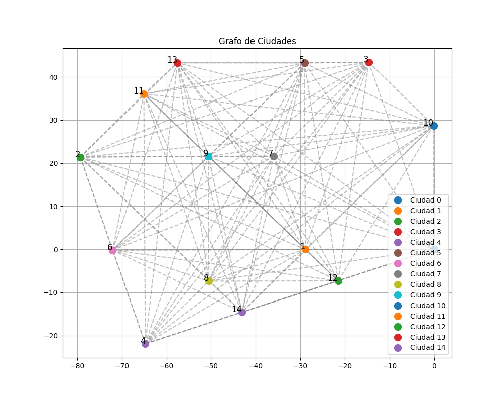
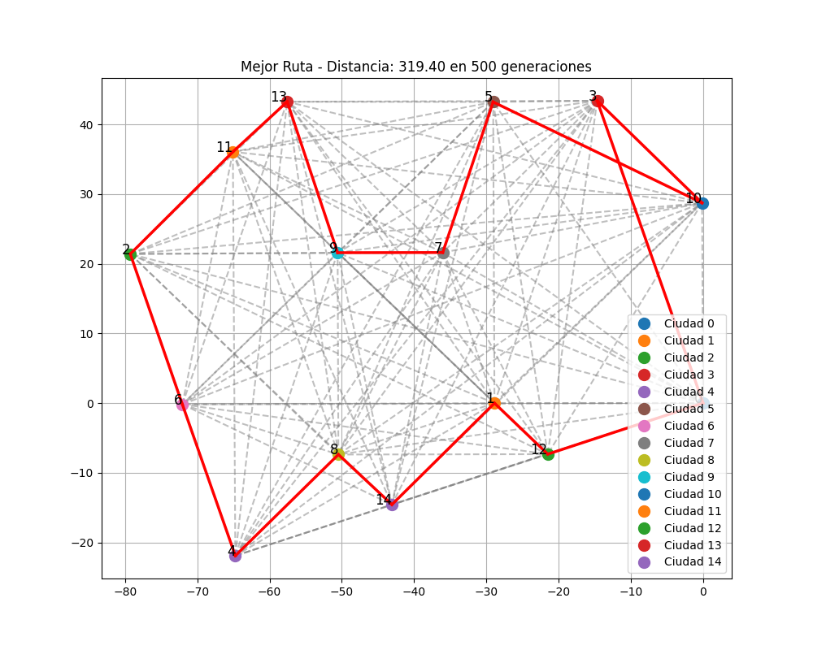

# Resolución del Problema del Agente Viajero (TSP) con Algoritmos Genéticos

Este proyecto aborda el **Problema del Agente Viajero (TSP)** utilizando un **Algoritmo Genético** (AG). El objetivo es encontrar la ruta más corta que pase por un conjunto de ciudades, recorriéndolas todas una sola vez y regresando al punto de inicio. Este problema es conocido por su complejidad, especialmente cuando el número de ciudades crece, ya que el número de rutas posibles aumenta exponencialmente. Los algoritmos genéticos son métodos efectivos para encontrar soluciones aproximadas en problemas de optimización complejos como el TSP.

## Enfoque de Resolución con Algoritmos Genéticos

### 1. Representación del Problema

Para aplicar un Algoritmo Genético, el problema se representa de la siguiente manera:

- **Cromosomas**: Cada posible solución (o ruta) se representa como un cromosoma, que en este caso es una secuencia de números, donde cada número representa una ciudad. Ejemplo: `[0, 3, 2, 5, 1, 4]` representa una ruta que parte de la ciudad `0`, sigue a la `3`, luego a la `2`, etc., y regresa a la `0`.
- **Población Inicial**: Se genera un conjunto de rutas aleatorias para crear la población inicial. Esta población evolucionará para acercarse a una solución óptima.

### 2. Función de Evaluación (Fitness)

La **función de fitness** mide la calidad de cada ruta en la población. En el TSP, esto se traduce en la **distancia total** de la ruta:
- Cuanto menor sea la distancia total de una ruta, mayor será su puntuación de fitness. 
- La función de evaluación se calcula sumando las distancias entre las ciudades consecutivas de la ruta y considerando el regreso a la ciudad de inicio.

### 3. Selección de Padres

Para crear la siguiente generación de rutas, se realiza una **selección de padres**:
- Las rutas con menor distancia (mejor fitness) tienen una mayor probabilidad de ser seleccionadas para crear la siguiente generación.
- En este caso, se utiliza una selección por puntuación: se seleccionan las rutas de la mitad superior de la población para reproducirse, simulando un proceso de selección natural.

### 4. Cruce (Crossover)

El **cruce** genera nuevas rutas combinando dos rutas (padres):
- Se selecciona un segmento de una ruta (padre1) y se completa la ruta usando las ciudades del segundo padre (padre2), sin repetir ninguna ciudad.
- Este proceso permite explorar nuevas combinaciones de rutas mientras conserva partes de las rutas más aptas.

### 5. Mutación

Para mantener la diversidad en la población y evitar estancarse en soluciones locales, se aplica **mutación**:
- Con una baja probabilidad, dos ciudades en una ruta intercambian su posición, creando una variación en la ruta.
- La mutación ayuda a explorar combinaciones que podrían no ser posibles solo con el cruce.

### 6. Proceso Evolutivo

El algoritmo genético se ejecuta por un número fijo de generaciones. En cada generación:
- Se calcula el fitness de cada ruta en la población.
- Se seleccionan las mejores rutas para cruzarse y generar la siguiente generación.
- Se aplica mutación en algunas rutas.
- El proceso se repite, y en cada generación se registra la mejor ruta obtenida hasta ese momento.

### 7. Resultados y Visualización

Al finalizar el número de generaciones especificado, el AG muestra la mejor ruta encontrada, su distancia total y las generaciones utilizadas para llegar a ella. A continuación, se muestra un ejemplo de la salida en la consola durante la ejecución del algoritmo:

```plaintext
Generación 1, Mejor Distancia: 478.45015813021087
Generación 101, Mejor Distancia: 319.3961726485149
Generación 201, Mejor Distancia: 319.3961726485149
Generación 301, Mejor Distancia: 319.3961726485149
Generación 401, Mejor Distancia: 319.3961726485149
Generación 500, Mejor Distancia: 319.3961726485149

Mejor Ruta: [13, 11, 2, 6, 4, 8, 14, 1, 12, 0, 3, 10, 5, 7, 9]
Distancia Total de la Mejor Ruta: 319.3961726485149
Generaciones Usadas: 500
```

### Visualización del Grafo de Ciudades

Antes de ejecutar el algoritmo genético, el grafo de ciudades y sus conexiones se muestran en un plano cartesiano para verificar la disposición de las ciudades:



### Mejor Ruta Encontrada

Después de ejecutar el algoritmo genético, se muestra el grafo de ciudades con la mejor ruta resaltada. La ruta en rojo representa el camino más corto que pasa por todas las ciudades y regresa al punto de partida:

